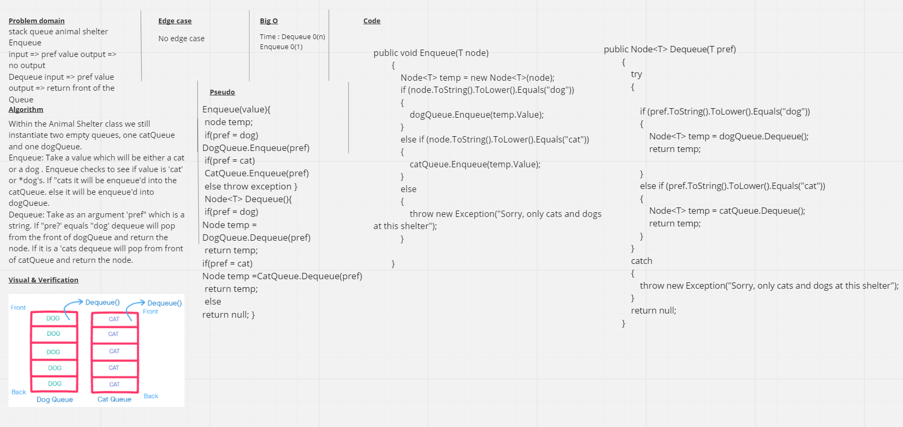

# FIFO Animal Shelter

## Challenge 
Create a class called AnimalShelter which holds only dogs and cats. The shelter operates using a first-in, first-out approach.
Implement the following methods:

* Enqueue(pref): adds pref to the shelter. animal can be either a dog or a cat 
* Dequeue(pref): returns either a dog or a cat. If pref is not "dog" or "cat" then return null.

## Approach & Efficiency
The Big O of the Dequeue algorithm is O(N) but for enqueue is O(1).

## Whiteboard 
