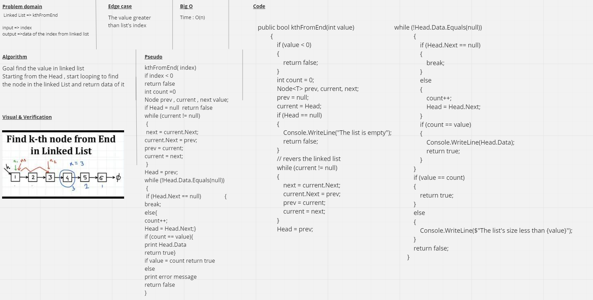
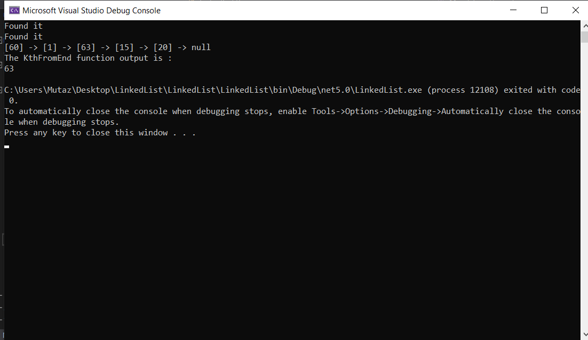
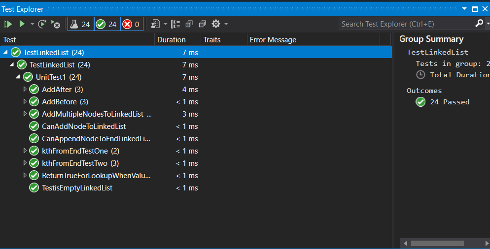

# linked-list-kth

The kthFromEnd function take a K value which it's the index to search about it from the end of linked list and git the value of the node at position K.

## Whiteboard Process

## Approach & Efficiency
Big O 
* Time = O(log n)  
* Big O Space = O(1)

## Solution
Run 

---

Test
