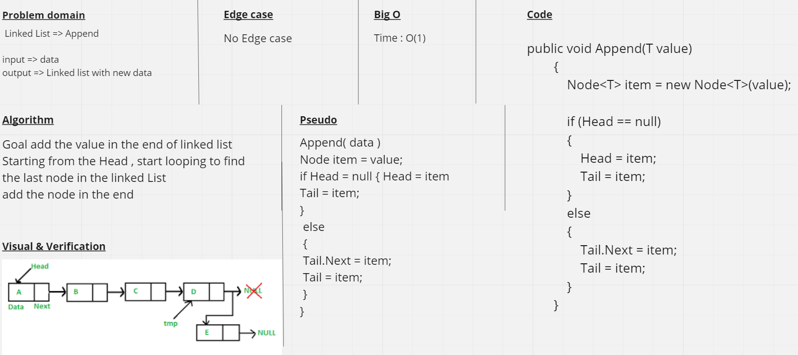
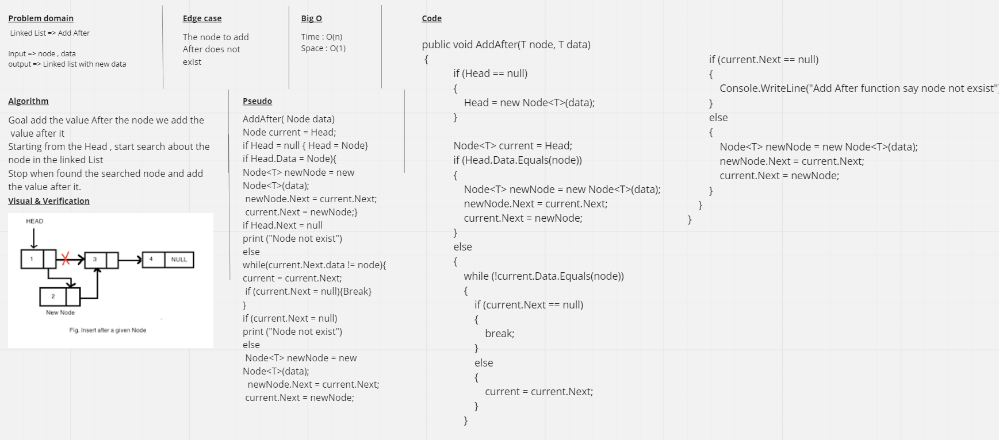
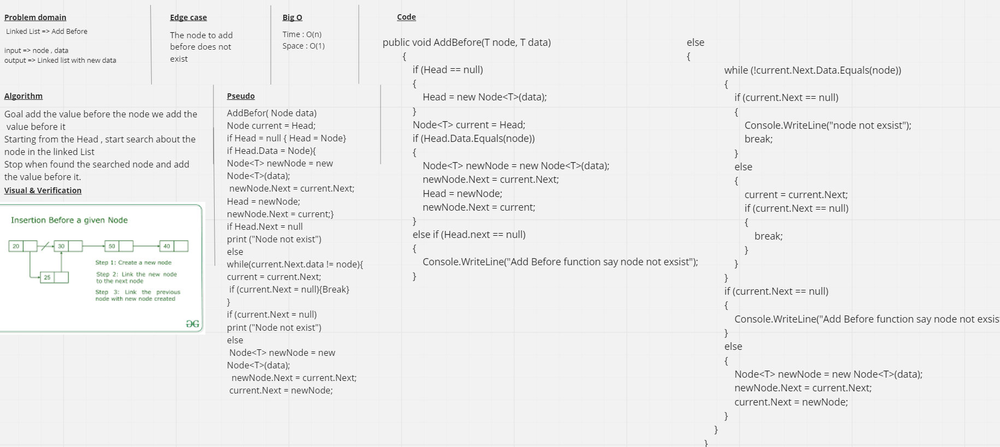

# Linked list

Linked List is a linear data structure made of a sequence of Nodes that are linked to each other. Each Node are linked together by the reference field.

---

## Advantages
1. Allows for fast operations on the ends
2. Dynamic data structure - flexible in size

## Disadvantages
1. Costly lookup
2. Not cache-friendly

---

## Big O

Time :
1. Append O(n) 
2. AddFirst O(1) 
3. Search O(n) 
4. AddAfter O(n) 
5. AddBefore O(n)

Space : O(1)

---

## API 
1. Append method to add the value end of linked list.
3. AddAfter method to add the data after the specific node
4. AddBefore method to add the data befor the specific node

## Whiteboard Process

**Append**

**AddAfter**

**AddBefor**
