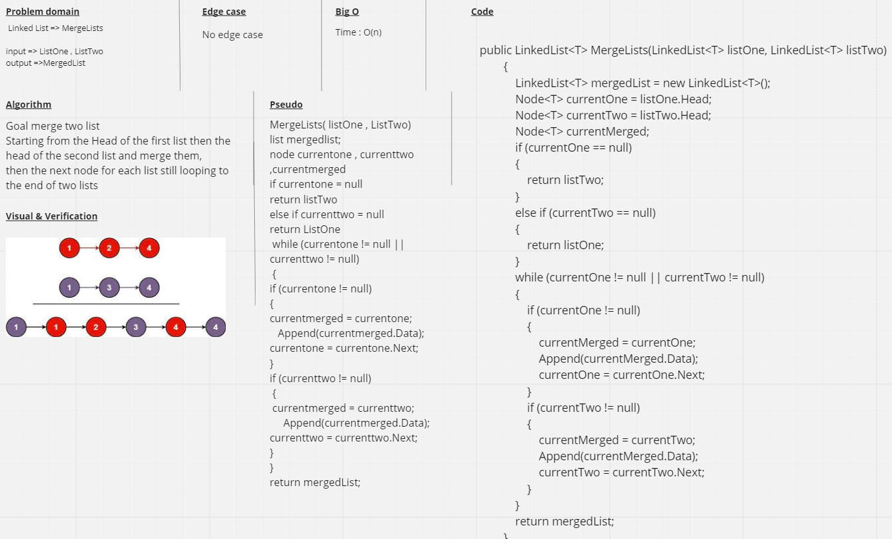
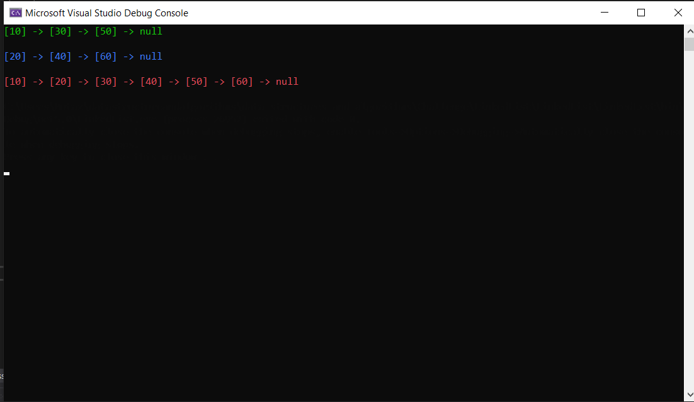
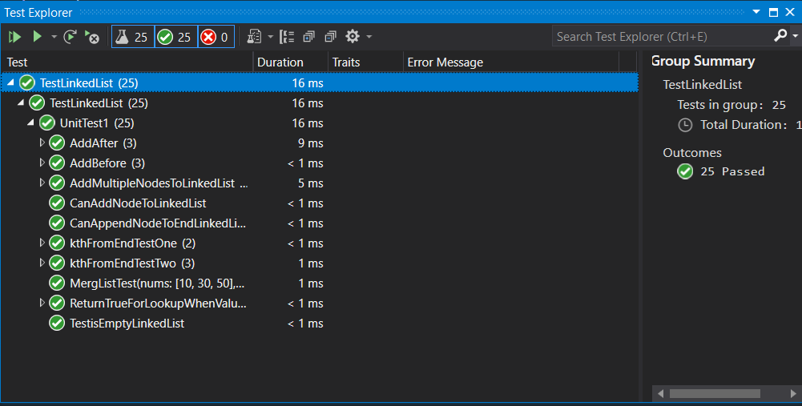

# Merge Two List

The MergedList function take two Lists as paramiters, this function merge these two lists and return new list after marged them.

# Whiteboard Process

# Solution
Run

---

Test
