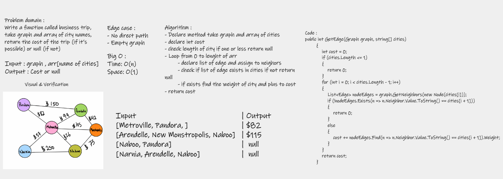

## Challenge 
Write a function that called GetEdge takes two paramiter (graph , list of cities) to get the edge between the cities.

## Approach & Efficiency
Time :O(N) 
Space :O(1)

## Whiteboard 
