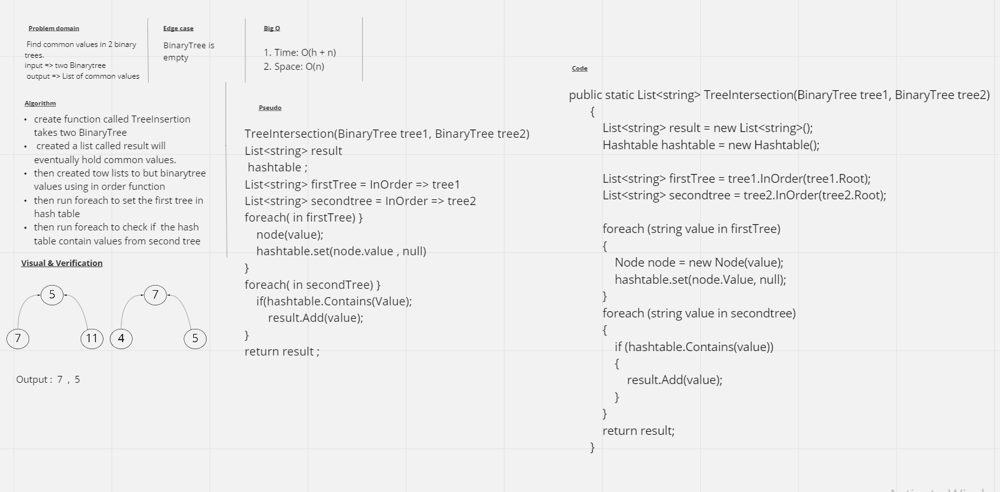

# Intersection of binary trees
Binary trees contain nodes with specific integers as values. There will be a possibility that there are matching values between two trees.

## Challenge
Write a function that takes two binary tree parameters. Without utilizing any of the built-in library methods available to your language, return a set of values found in both trees.

## Approach & Efficiency
I approached this problem by traversing the two trees using a PreOrder, which returns a list of integer values.  I then entered the first tree into a hashtable setting the key and value to the same number.  I then used the Contains method from the hashtable to see if the number already exists.  If it did, then I would save that value into a list which is then returned.

- ### Time: O(h+n)  
- ### Space: O(n)

## Whiteboard
