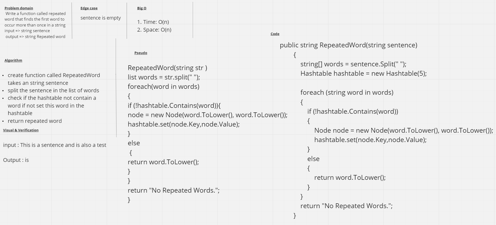

# Repeated Word
Use hashtable properties to find if there are repeated values.

## Challenge
Write a function that accepts a lengthy string parameter. Return the first word to occur more than once in that provided string.

## Approach & Efficiency
Create a hashtable. Split the string by the space.  Iterate through the resulting array of words.  Check to see if the normalized word exists in the hashtable, if not add it, if so return the word.

- ### Time: O(n)  
- ### Space: O(n)

## Whiteboard 
