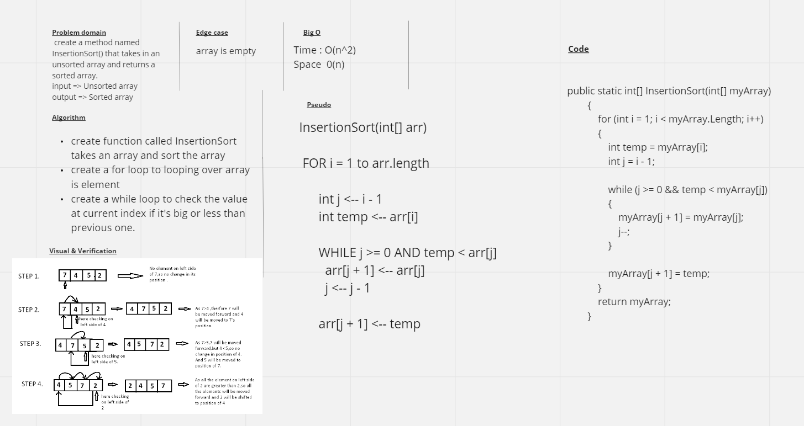

# Insertion Sort
The Insertion sort is a simple sorting algorithm that sorts arrays one item at a time. It is the most efficient of the simple sorts, but much less efficient than more complex algorithms.  Sorting is typically done in-place, by iterating up the array, growing the sorted list behind it. At each array-position, it checks the value there against the largest value in the sorted list. If larger, it leaves the element in place and moves to the next. If smaller, it finds the correct position within the sorted list, shifts all the larger values up to make a space, and inserts into that correct position.

## Challenge
 create a method named InsertionSort() that takes in an unsorted array and returns a sorted array.

Inside your Main():

- Output the unsorted array.
- Send the array through your InsertionSort()
- Output the sorted array

## Approach & Efficiency
- ### Time: O(n^2)  
- ### Space: O(n)

## Whiteboard Process
