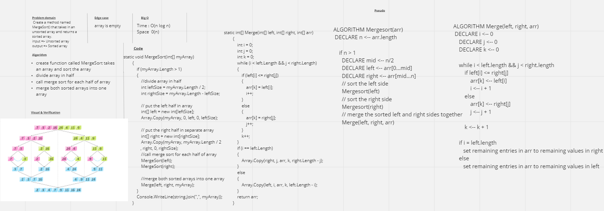

# Merge Sort
The Merge Sort is stable a "Divide and Conquer Algorithm".  It divides an unsorted array in half repeatedly until there is only one value in an array.  From there, it then compares the values from the left and right arrays and inputs adds them into a new array in a sorted pattern.

## Challenge
Create a method named MergeSort() that takes in an unsorted array and returns a sorted array.

- output the unsorted array.
- Send the array through your MergeSort()
- Output the sorted array

## Approach & Efficiency
### Efficiency:
1. Time: O(n log n)
2. Space: O(n)

## Whiteboard 
