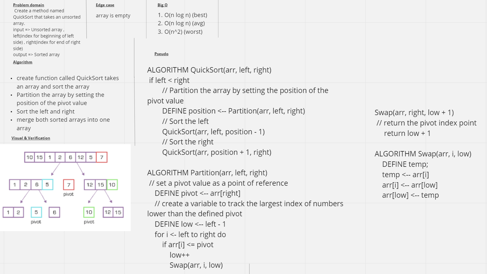

# Quick Sort
The Quick Sort is a "Divide and Conquer Algorithm".  It picks a pivot point and moves the values to either the right or the left of it in the array.  It sorts on half and then sorts the other half using recursion and helper functions.  This algortithm is not stable because it does not keep track of the placement/order within the array.

## Challenge
Create a method named QuickSort that takes an unsorted array.
Within Main, Output the console the contents of the unsorted array
- Conduct the quick sort
- Return the sorted array
- Output to the console the contents of the sorted array

## Approach & Efficiency
### Efficiency:
1. O(n log n) (best)
2. O(n log n) (avg)
3. O(n^2) (worst)

## Whiteboard

