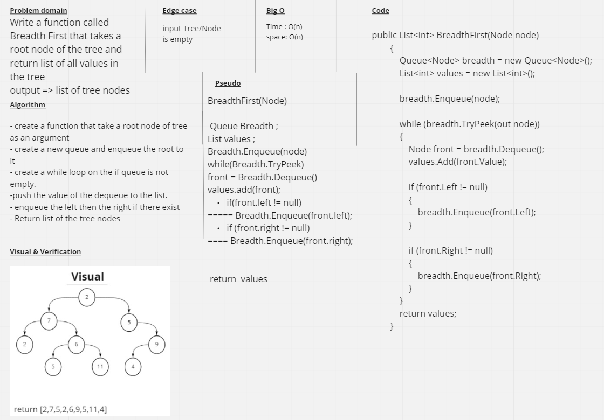

## Challenge
Write a function called breadth first that takes binary root node of the tree as an arguments and Return list of all values in the tree.

## Approach and Efficiency
Time O(n).

space O(n).

## Whiteboard Process
