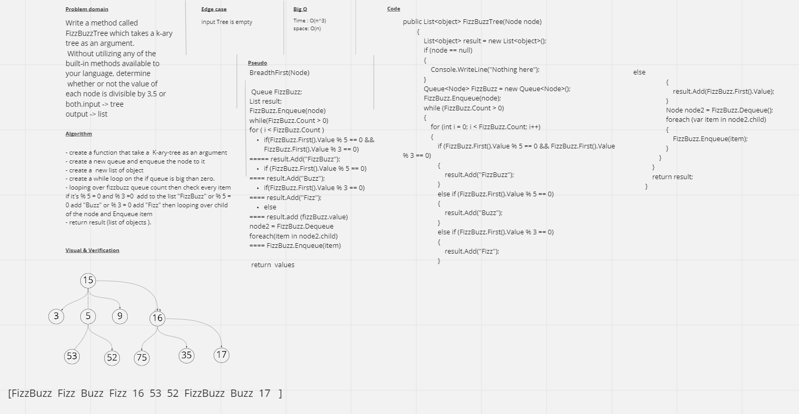

# Challenge Summary
Write a method called FizzBuzzTree which takes a node as an argument. Check if the value of each node is divisible by 3, 5 or both, and display Fizz, Buzz, or FizzBuzz, Return a list with the new values.

## Approach & Efficiency
Time: O(n^3)
Space: O(n)

## Whiteboard Process
