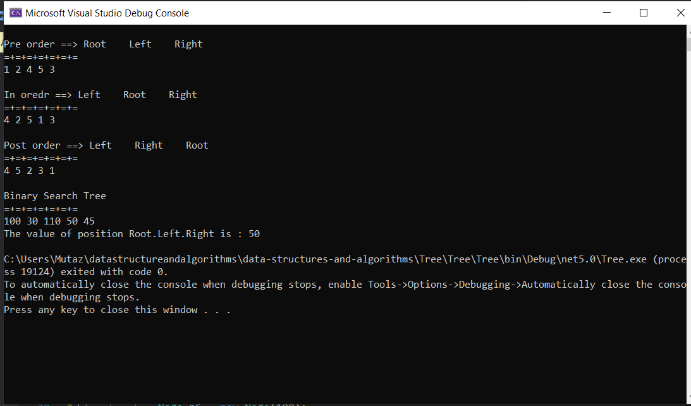
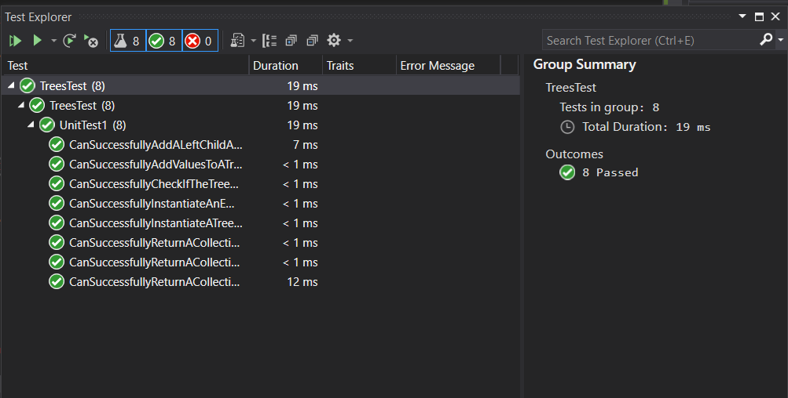

# Trees
Binary Trees are trees that only contain nodes who’s value are numeric types. There is not a specific sorting order for a binary tree. When adding a node to a binary tree, you are not restricted on the node’s location. A binary search tree, however, is a type of tree that does have structure attached to it. In a binary search tree, the tree is organized in a manner where all numbers that are smaller than the root are placed to the left, and all numbers that are larger than the root are placed to the right.

## Challenge
* Create a BinaryTree class and define a method for each of the depth first traversals called preOrder, inOrder, and postOrder which takes in a root node, and returns an array of the nodes.

* Create a BinarySearchTree class and define a method named add that adds a new node in the correct location in the binary search tree as well as a method named Contains to check if the value is exist in the tree or not.

## Approach and Efficiency
* PreOrder, PostOrder, and IOrder Traversal all have Time O(n) 

* Binary Search Tree for insertion and search is O(log n) 

## visual

## **Run**

## **Test**

## Link to the code
* [Tree](/Tree/Tree/Tree/Program.cs)
