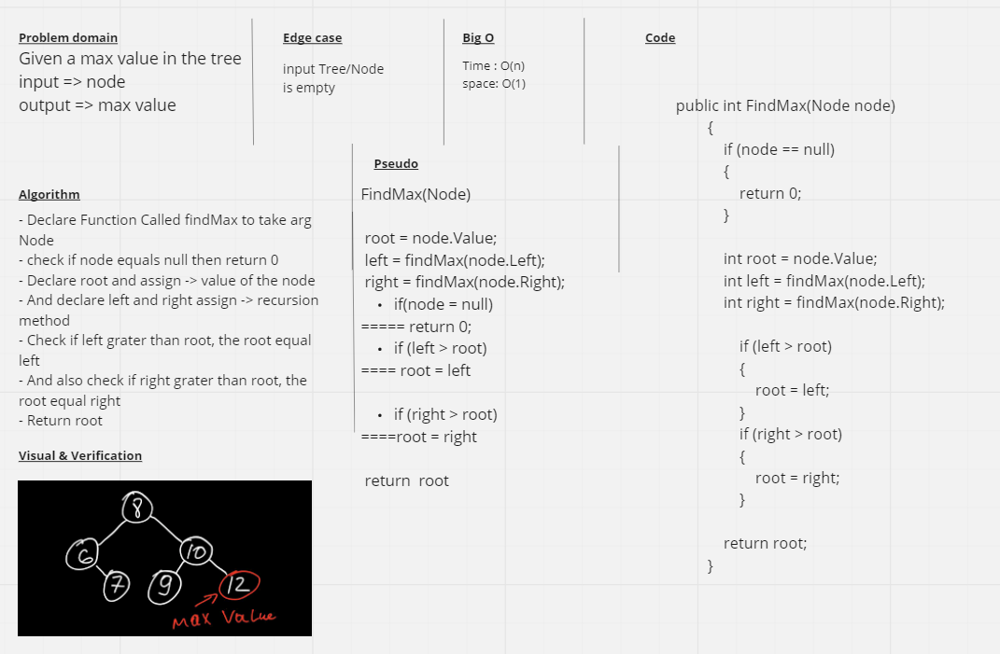

# Trees
Binary Trees are trees that only contain nodes who’s value are numeric types. There is not a specific sorting order for a binary tree. When adding a node to a binary tree, you are not restricted on the node’s location. A binary search tree, however, is a type of tree that does have structure attached to it. In a binary search tree, the tree is organized in a manner where all numbers that are smaller than the root are placed to the left, and all numbers that are larger than the root are placed to the right.

## Challenge
Create a method called FindMax to find the max value in the tree which it takes a tree then return the max value of it.

## Approach and Efficiency
Time O(n).

space O(1).

## Whiteboard Process
