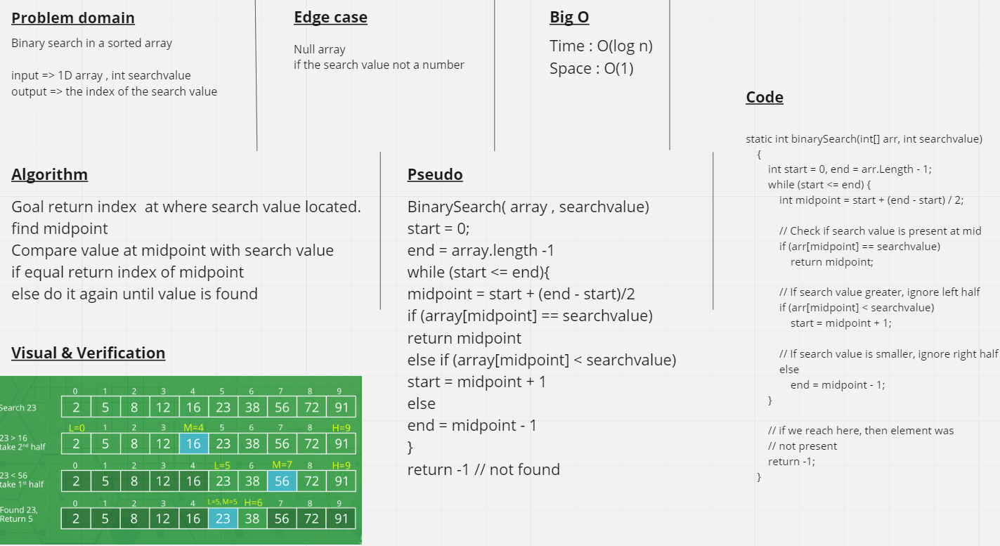

# array-binary-search

Write a function called BinarySearch which takes in 2 parameters: a sorted array and the search key, return the index of the array element that is equal to the search key, or -1 if the element does not exist.

---

## Approach & Efficiency
Big O Time = O(log n) // Big O Space = O(1)
The iterative approach to binary search comes with a logn time because the array is continually being divided in half after every comparison. Since no other space is being analyzed or used, it stays at O(1).

---

## Whiteboard Process
