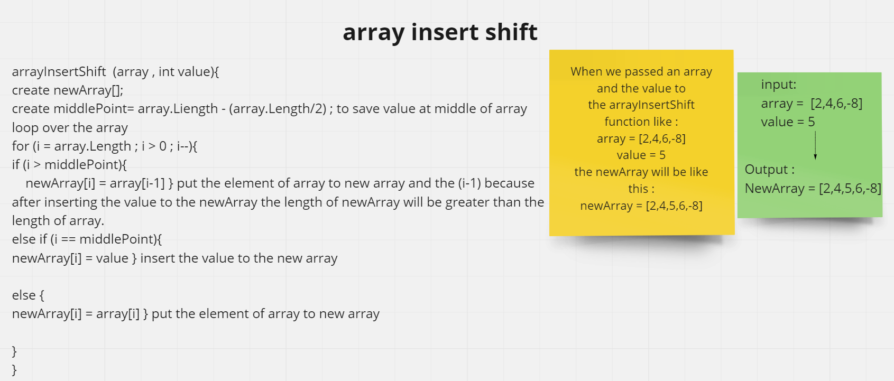

# array insert shift

Write a method called arrayInsertShift which it takes an array and value to be inserting inside the array. 
we write the code without utilizing any of the built-in methods available.
Then our method push the value in the middle of array by using new array and return the new array which is like what we expecting.

---

## Whiteboard Process
