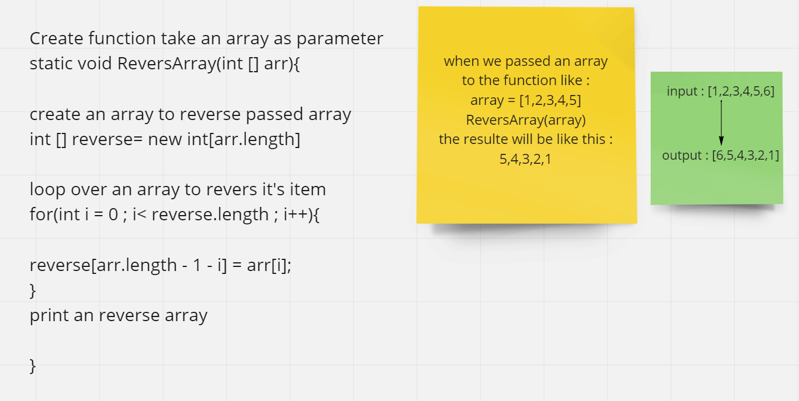

# Reverse an Array

Write a method called ReverseArray which takes in an array and the value to be reversed. Without utilizing any of the built-in methods available to your language, return the array with value reversed.

---

## Whiteboard Process
