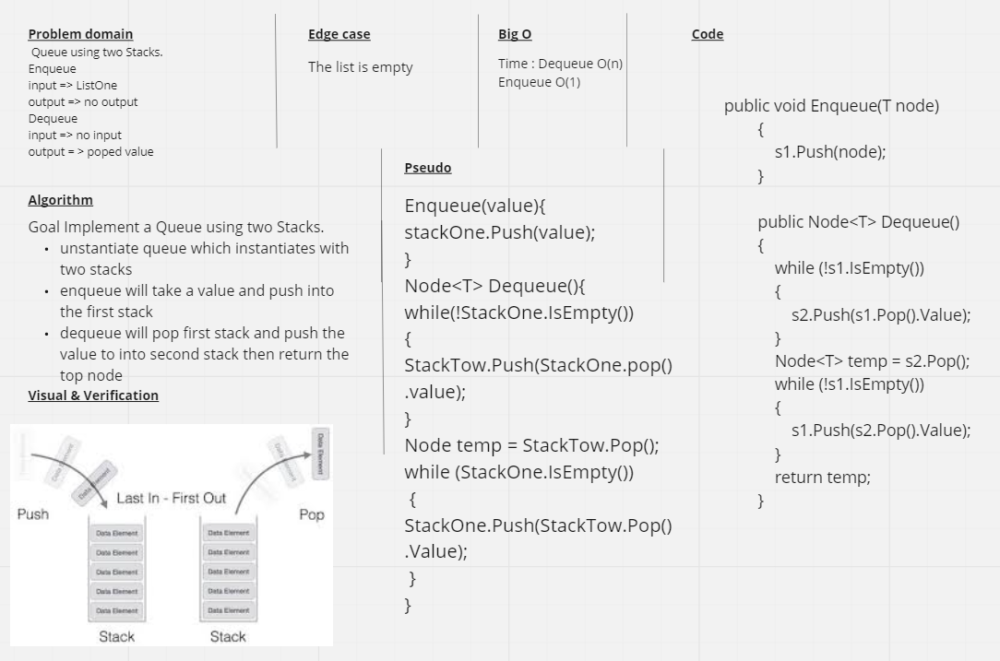

# stack-queue-pseudo

## Challenge 
Challege is to create a method that adds values in stacks but when dequeuing the stack, we get the value at the very bottom instead of the top. Same as first in first out(FIFO).

## Approach & Efficiency
The Big O of the Dequeue algorithm is O(N) but for enqueue is O(1).

## Whiteboard 

