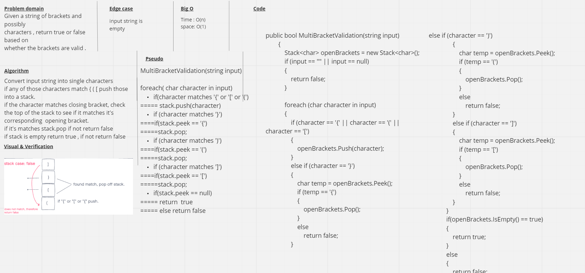

# stack-queue-brackets

## Challenge 
Given a string of brackets and characters, return true or false based on whether the brackets are valid.

## Approach & Efficiency
Time: O(n)

Space: O(1)

## Whiteboard 
.